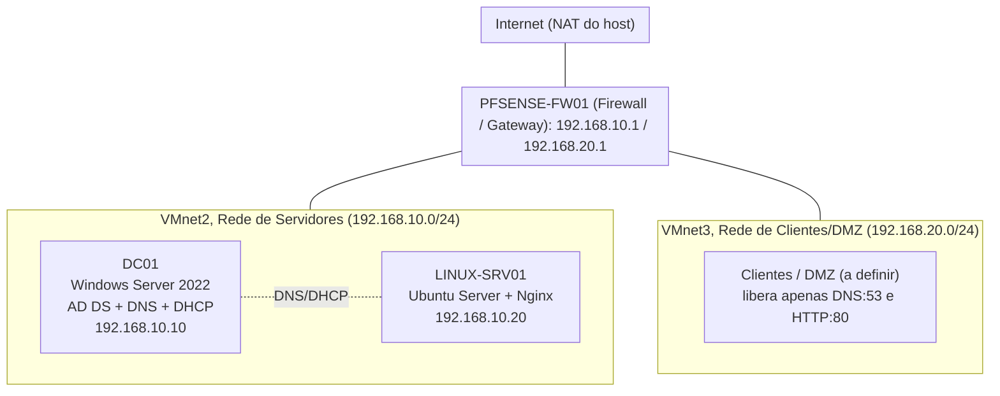

# Home Datacenter Lab

Simulação de um datacenter corporativo em casa, usando virtualização, para desenvolver habilidades práticas de infraestrutura: redes, Windows, Linux, firewall e backup.

## Objetivo

- Servidor Windows Server como Controlador de Domínio (AD DS), DNS e DHCP.
- Servidor Linux rodando Nginx.
- Rede interna segmentada, simulando sub-redes corporativas.
- Firewall (pfSense) com regras de acesso entre redes.
- Rotina de backup documentada (RPO/RTO, frequência, retenção).

## Arquitetura



## Ferramentas

Hypervisor: VMware Workstation Pro.
Windows: Windows Server 2022 Evaluation.
Linux: Ubuntu Server LTS com Nginx.
Firewall: pfSense CE 2.7.2.
Backup: script PowerShell (vmrun) com snapshot automatizado e retenção.

## Política de backup

RPO de 24 horas, execução diária. RTO estimado em 2 horas, tempo de restauração via snapshot. Retenção dos últimos 7 snapshots automáticos por VM. A rotina roda pelo script [`snapshot-backup.ps1`](./scripts/snapshot-backup.ps1), via `vmrun` (CLI do VMware Workstation), agendado pelo Agendador de Tarefas do Windows.

## Progresso

- [x] Instalação do VMware Workstation Pro
- [x] Criação das redes virtuais segmentadas (VMnet2 e VMnet3)
- [x] Download e instalação do Windows Server 2022 (Desktop Experience)
- [x] Configuração de IP estático e nome do servidor (DC01)
- [x] Promoção a Controlador de Domínio (domínio `italia.local`)
- [x] Instalação e configuração do DNS
- [x] Instalação, autorização e configuração de escopo do DHCP (`192.168.10.50-100`)
- [x] Criação da VM Linux com serviço (Ubuntu Server + Nginx)
- [x] Deploy do pfSense e segmentação de rede (regras de firewall entre VMnet2 e VMnet3)
- [x] Implementação da rotina de backup (RPO/RTO documentado)

## Estrutura do repositório

```
/
├── README.md
├── DECISÕES.md
├── screenshots/   (capturas de tela, na ordem em que as etapas foram feitas)
└── scripts/       (scripts de automação)
```

## Autor

Lucas, estudante de Ciência da Computação e estagiário de TI, em desenvolvimento de habilidades para infraestrutura e cibersegurança.
