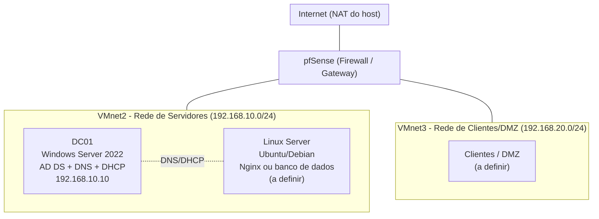

# Home Datacenter Lab

Simulação de um pequeno datacenter corporativo em casa, usando virtualização, para desenvolver e demonstrar habilidades práticas de infraestrutura (redes, Windows/Linux, virtualização, backup e segurança).

## Objetivo

Montar um ambiente virtualizado com:

- Servidor Windows Server atuando como Controlador de Domínio (AD DS), DNS e DHCP.
- Servidor Linux rodando um serviço (Nginx ou banco de dados).
- Rede interna segmentada, simulando sub-redes corporativas.
- Rotina de backup documentada (RPO/RTO, frequência, retenção).
- Camada de segurança básica com firewall (pfSense) e hardening.

## Arquitetura planejada



## Ferramentas utilizadas

| Camada | Ferramenta |
|---|---|
| Hypervisor | VMware Workstation Pro |
| Sistema Windows | Windows Server 2022 Evaluation |
| Sistema Linux | Ubuntu/Debian (a definir) |
| Firewall | pfSense |
| Backup | Veeam Community Edition ou scripts de snapshot |

## Progresso

- [x] Instalação do VMware Workstation Pro
- [x] Criação das redes virtuais segmentadas (VMnet2 e VMnet3)
- [x] Download e instalação do Windows Server 2022 (Desktop Experience)
- [x] Configuração de IP estático e nome do servidor (DC01)
- [x] Promoção a Controlador de Domínio (domínio `italia.local`)
- [x] Instalação e configuração do DNS
- [x] Instalação, autorização e configuração de escopo do DHCP (`192.168.10.50-100`)
- [ ] Criação da VM Linux com serviço (Nginx ou banco de dados)
- [ ] Deploy do pfSense e segmentação de rede
- [ ] Implementação da rotina de backup (RPO/RTO documentado)
- [ ] Hardening básico de segurança

## Estrutura do repositório

```
/
├── README.md
├── DECISIONS.md
├── screenshots/
│   ├── 01-vmware-network-editor.png
│   ├── 02-server-manager-addds.png
│   ├── 03-active-directory-users-computers.png
│   └── 04-dhcp-scope.png
└── scripts/
    └── (scripts de backup, futuramente)
```

## Autor

Lucas — estudante de Ciência da Computação e estagiário de TI, em desenvolvimento de habilidades para carreira em infraestrutura/cibersegurança.
